<div align="center">


# BU Scheduler

**A student class-timetable, course-group, and reminders app for Babcock University students.**

Part of the wider **StudentHub** platform — one identity, many student apps.

[](#1-what-this-repository-actually-is)
[](#5-technology-stack)
[](#7-the-backend-firebase--firestore)
[](#12-progressive-web-app-pwa)

</div>

---

## Table of contents

1. [What this repository actually is](#1-what-this-repository-actually-is)
2. [What the app does](#2-what-the-app-does)
3. [Who it is for](#3-who-it-is-for)
4. [Screenshots](#4-screenshots)
5. [Technology stack](#5-technology-stack)
6. [Frontend or backend? A straight answer](#6-frontend-or-backend-a-straight-answer)
7. [The backend: Firebase / Firestore](#7-the-backend-firebase--firestore)
8. [Architecture and how it works](#8-architecture-and-how-it-works)
9. [Repository layout](#9-repository-layout)
10. [Routing map](#10-routing-map)
11. [Authentication, sessions and roles](#11-authentication-sessions-and-roles)
12. [Progressive Web App (PWA)](#12-progressive-web-app-pwa)
13. [Getting started (installation and usage)](#13-getting-started-installation-and-usage)
14. [Environment variables](#14-environment-variables)
15. [npm scripts](#15-npm-scripts)
16. [Capturing screenshots with Playwright](#16-capturing-screenshots-with-playwright)
17. [Deployment](#17-deployment)
18. [Known issues and gotchas](#18-known-issues-and-gotchas)
19. [Further documentation](#19-further-documentation)

---

## 1. What this repository actually is

BU Scheduler is a **single-page web application (SPA)** — a browser-only React client. There is **no Node/Express server in this repository**. The app talks directly to **Google Firebase** (Authentication + Cloud Firestore) from the browser, using the Firebase Web SDK.

> **Important correction to older documentation.** Previous versions of this README described a companion Express API in a `/backend` folder, running on port `4000`, with routes like `POST /api/auth/login`. **That folder does not exist in this repository.** Leftover references to it survive in `package.json` (`build:backend`, `start`), in `render.yaml`, and in the files under `docs/`. Those describe a *planned or separately-hosted* service, not code you can run from this checkout. Everything you need to run BU Scheduler today is the frontend plus a Firebase project.

At a glance:

| Question | Answer |
| --- | --- |
| Is this frontend or backend? | **Frontend.** A React 19 + Vite 7 + TypeScript SPA. |
| Where does data live? | **Cloud Firestore**, accessed directly from the browser. |
| Where does auth live? | **Firebase Authentication** (email + password). |
| Is there a server to run? | **No.** `npm run dev` starts Vite; that's the whole stack. |
| What secures the data? | **`firestore.rules`** — ~900 lines of server-side security rules. |
| Can it work offline? | **Partially.** IndexedDB cache + Firestore persistence + a service worker. |

---

## 2. What the app does

BU Scheduler answers one recurring student question — *"where am I supposed to be, and when?"* — and then wraps the social layer around it.

### Core features

**📅 Timetable**
Displays the student's weekly class schedule with live, time-aware status. Each class is marked `completed`, `in-progress`, `upcoming`, or `next`, with a progress bar for the class currently running. Four view modes are available: **Week**, **Day**, **List**, and a **Calendar Overview**. Entries carry course code, course name, day, start/end time, venue, and instructor.

**👥 Course groups**
Students browse and join public course groups (e.g. *"COSC 302 — 300 Level, Group B"*), or join privately by group ID / invite code. Each group has a schedule, member list, chat, and announcements board. Joining a group is what populates a student's timetable — the app derives your schedule from your groups' published timetables.

**💬 Group chat**
Real-time messaging inside each group, backed by Firestore snapshot listeners. Messages carry role badges (Group Rep, Course Rep, Course Admin, Admin), reactions, edit/delete state, and avatars. Reps can disable chat for a group.

**📢 Announcements**
Group representatives publish titled announcements to their group; members see them in the group detail page and as notifications.

**🔔 Notifications**
An aggregated inbox with severity tones — **Urgent**, **Important**, **Info**, **Update** — plus filters (All / Unread / Urgent / Important) and a stat summary. Fed from the `notifications` and `courseNotifications` collections.

**🛠️ Group management (reps only)**
A dedicated console for Group Reps / Course Reps / Course Admins with five sections: **Timetable** (add / edit / delete classes), **Members** (add, remove, promote, demote), **Chat** (moderate and delete messages), **Announcements** (broadcast), and **Settings** (public/private visibility, password-protected destructive actions).

**📥 Bulk import**
A CSV/ICS upload flow for reps to import a whole term's timetable at once. Fields: `title, subject_code, start, end, timezone, recurrence, location`. **Note:** this page is currently a permission-gated UI scaffold — the parser and commit step are not wired up yet.

**👤 Profile and settings**
Four tabs — Profile, Notifications, Account, Help — covering display name, nickname, bio, avatar, notification preferences, and sign-out.

**🐻 Onboarding and the bear**
A six-step first-run tour (Welcome → Dashboard → Groups → Timetable → Notifications → Account) and an animated bear mascot on the login screen that reacts to what you're doing: it *tracks* your cursor while you type your email, *covers its eyes* while you type your password, *peeks* when you toggle visibility, looks *sad* on an error and *happy* on success. It has synthesized Web Audio sound effects, muteable, and it respects `prefers-reduced-motion`.

### Guest mode

Unauthenticated visitors are **not** hard-blocked. `AuthRouteGate` in `src/RootApp.tsx` lets anonymous users browse the shell — navigation, empty states, page structure — and only prompts for sign-in via the `AuthRequiredModal` when they attempt a protected action. This is deliberate: it lets a prospective student see what the app is before committing.

---

## 3. Who it is for

| Audience | What they get |
| --- | --- |
| **Students** (primary) | See your week, know your next class, join your course group, chat with coursemates, receive announcements. |
| **Group Representatives** | Maintain one group's timetable, moderate its chat, manage its members, broadcast announcements. |
| **Course Representatives** | The same, scoped to a course across a study level (e.g. all 300-level COSC groups). |
| **Course Administrators** | Faculty/department-level control over course groups; the only role that can bulk-import without a group context. |
| **Platform admins** | Full access, defined by `role == 'admin'` on the user document. |
| **Developers** | A self-contained React SPA you can run with two commands and a Firebase config. |

The default email domain in the sign-in picker is `@student.babcock.edu.ng`, which is the clearest signal of the intended user base. `@gmail.com` and `@yahoo.com` are also offered, and the list is trivially extensible — see the documented block at the top of `src/lib/emailProviders.ts`.

---

## 4. Screenshots

All screenshots below were captured automatically with Playwright against a locally running dev server. Regenerate them any time with `npm run screenshots` (see [§16](#16-capturing-screenshots-with-playwright)).

They show the app in **guest / signed-out state with an empty Firebase project**, which is why counts read `0` and lists show empty states. This is genuinely what a brand-new user sees before joining a group — the empty states are a real, designed part of the product.

### Login

The animated bear mascot, the email-provider picker, and the split email input.

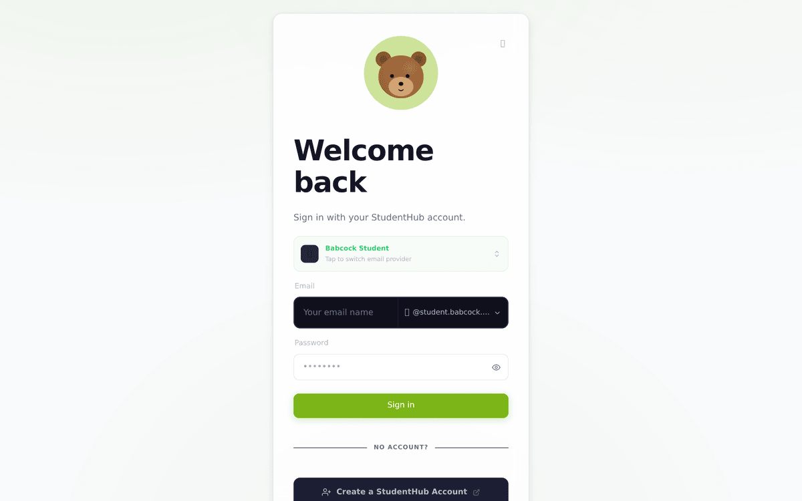

### Dashboard (Home)

Next-class hero card, four-stat summary strip, your groups, and the persistent left navigation.

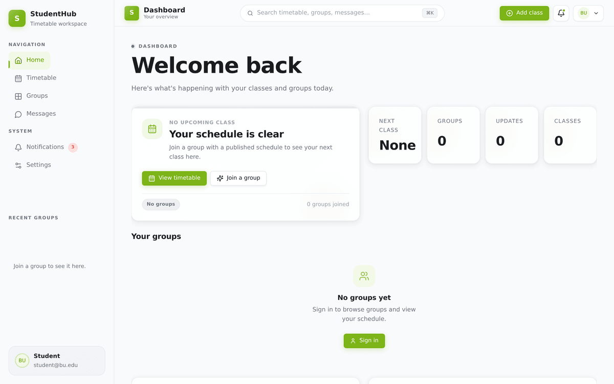

### Timetable

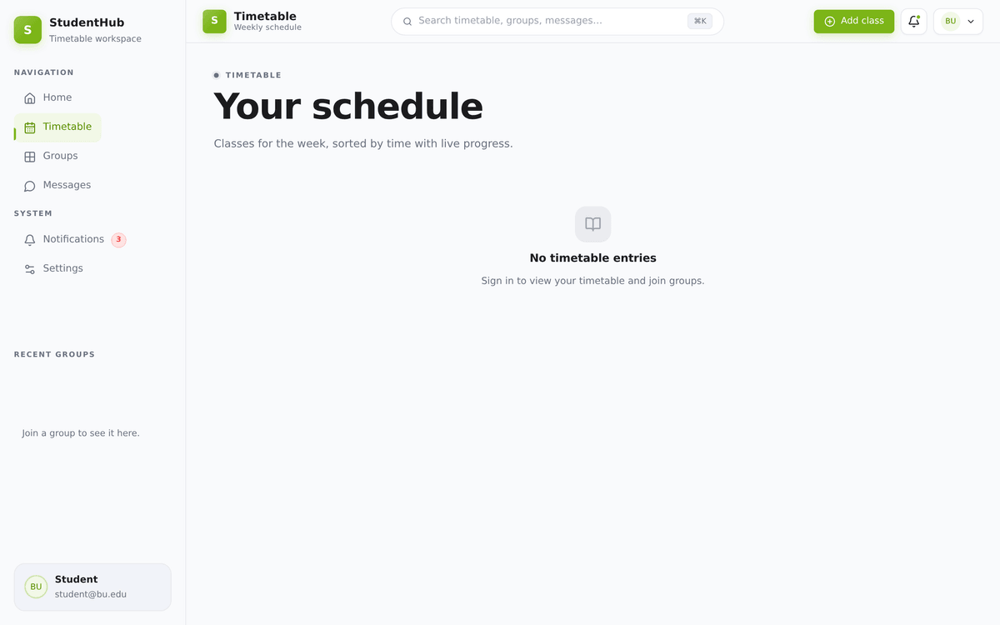

### Groups

Search by course code or group name, or join privately by ID.

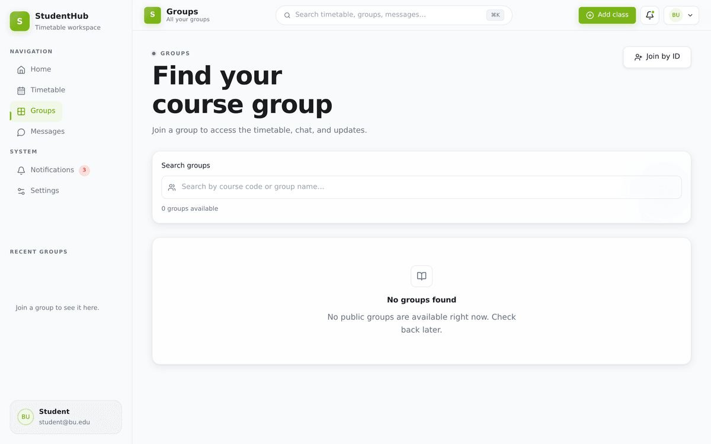

### Messages

The dark-themed group chat surface.

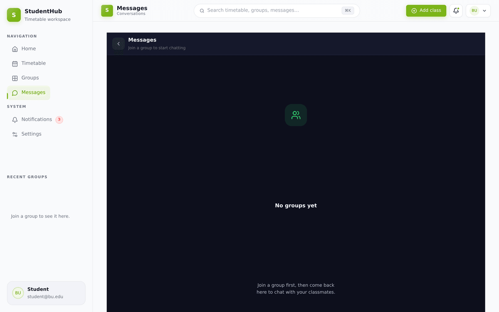

### Notifications

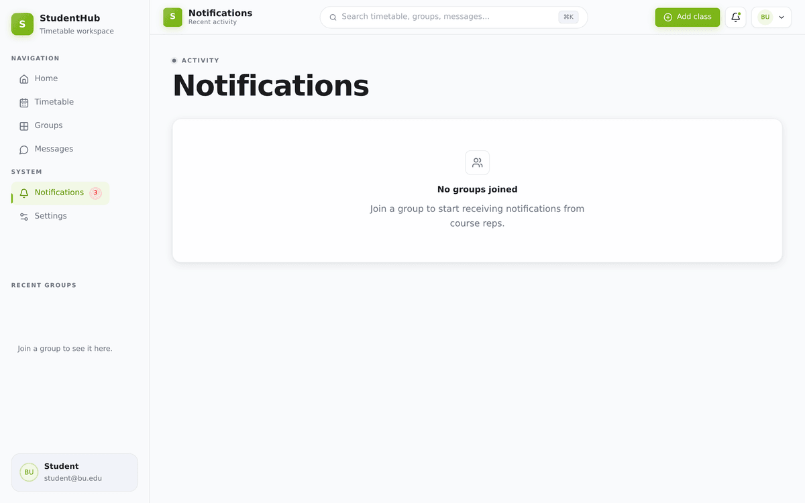

### Account settings

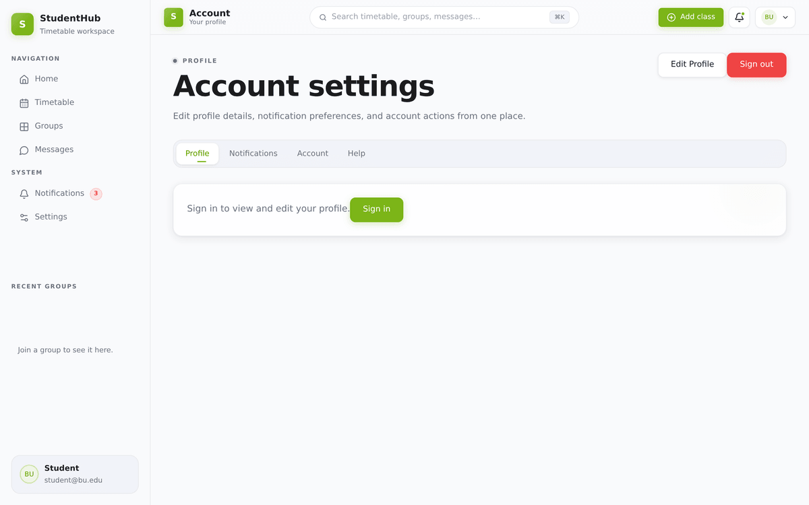

### Bulk import

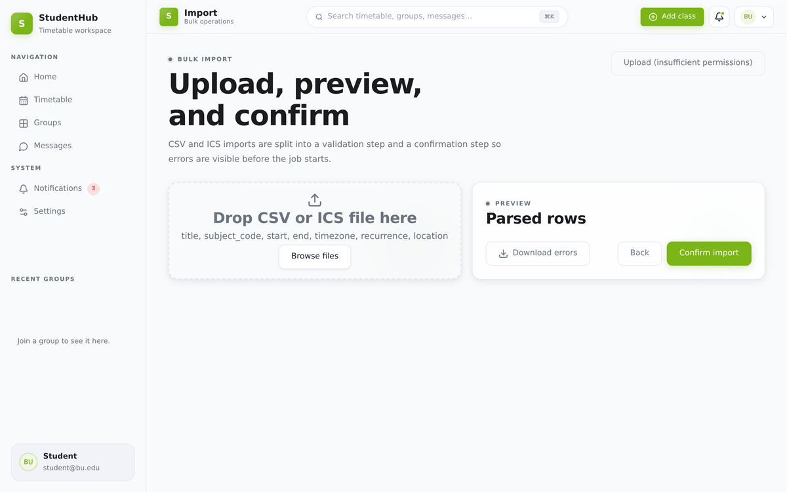

### Mobile

The layout switches to a bottom tab bar (Home · Schedule · Groups · Profile) below 900px.

<p>
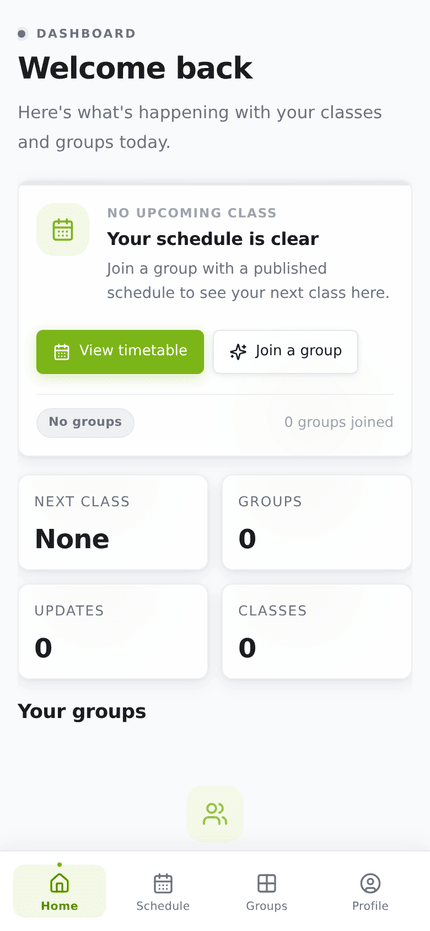
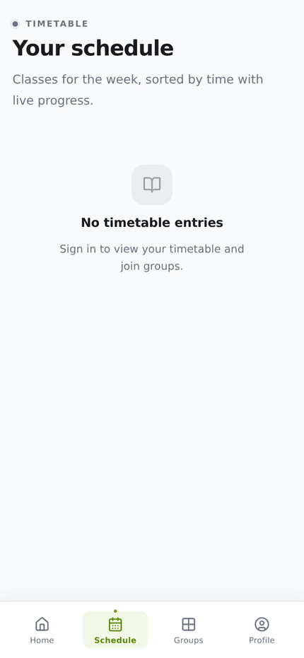
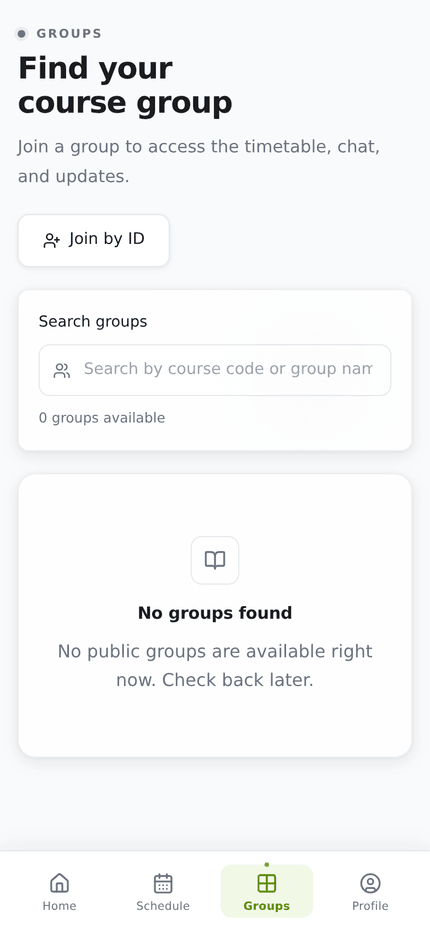
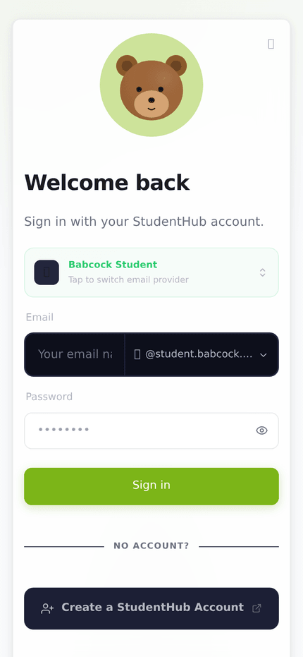
</p>

Every capture, desktop and mobile, lives in [`docs/screenshots/`](docs/screenshots).

---

## 5. Technology stack

| Layer | Choice | Version | Why it's here |
| --- | --- | --- | --- |
| UI framework | **React** | 19.1 | Component model; uses the modern `createRoot` API. |
| Language | **TypeScript** | 5.8 | `strict: true`, `noEmit` — types check, Vite transpiles. |
| Build tool | **Vite** | 7.0 | Dev server + Rollup production build. |
| React transform | **@vitejs/plugin-react-swc** | 3.9 | SWC instead of Babel — noticeably faster HMR. |
| Routing | **react-router-dom** | 6.30 | `BrowserRouter`, nested routes, route guards. |
| Server state | **@tanstack/react-query** | 5.80 | Caching, refetching, loading/error states for Firestore reads. |
| Client state | **zustand** | 5.0 | Two small stores: `useAuthStore`, `useAppStore`. |
| Backend SDK | **firebase** | 12.13 | Auth + Firestore, called directly from the browser. |
| Animation | **framer-motion** | 12.40 | Bear mascot, provider picker, profile transitions. |
| Icons | **lucide-react** | 0.525 | Consistent line-icon set throughout. |
| Offline | **workbox-precaching** | 7.4 | Service-worker precache manifest. |
| Screenshots | **playwright** | 1.6x | Dev dependency; drives the docs capture script. |

Styling is **plain CSS** — a single 3,056-line `src/app.css` using CSS custom properties and `@layer` (reset → tokens → base → layout → components → utilities → responsive → a11y). No Tailwind, no CSS-in-JS. Fonts are Inter and DM Sans from Google Fonts; the brand colour is lime green `#7CB518`.

> `boneyard-js` is listed as a dependency but is not imported anywhere in `src/`. It is safe to remove.

---

## 6. Frontend or backend? A straight answer

**This repository is a frontend.** Nothing in it runs on a server.

Where the "backend" concerns live:

| Backend concern | Where it is handled |
| --- | --- |
| Identity / login | **Firebase Authentication** (Google's service) |
| Data storage | **Cloud Firestore** (Google's service) |
| Authorization | **`firestore.rules`** — deployed to Firebase, enforced server-side |
| Real-time updates | **Firestore `onSnapshot`** listeners, opened from the browser |
| Business logic | **In the client**, mostly `src/lib/studenthubData.ts` |
| Static hosting | **Vercel** (config in `vercel.json`) |

This is a **serverless / BaaS** architecture. The consequence worth internalising: because every read and write originates in the user's browser, **`firestore.rules` is the only thing standing between a user and everyone else's data.** Client-side role checks like `getGroupRoleFlags()` shape the UI — they hide buttons a student shouldn't press — but they are not security. The rules file is.

### The `/api` proxy and StudentHub SSO

Two vestigial paths point at an external service:

- `vite.config.ts` proxies `/api/*` in development to `VITE_API_BASE_URL` (default `http://localhost:4000`). Nothing in `src/` currently calls a relative `/api` path, so this proxy is inert.
- `src/lib/auth.ts` (362 lines) contains a **complete, working PKCE OAuth2 / OIDC client** for StudentHub SSO — code challenge generation, state and nonce handling, `sessionStorage`-backed pending requests, code exchange, remote logout. It is **not currently wired into the login flow.** `useAuthStore.bootstrap()` uses Firebase `onAuthStateChanged` instead, and `signInWithPassword()` in that module deliberately throws `"Local password login is disabled."`

So `src/lib/auth.ts` is best read as a *ready-to-activate* SSO module, kept warm for when the hosted StudentHub OIDC provider comes online. `AuthCallbackPage` currently just redirects back to `/login`.

---

## 7. The backend: Firebase / Firestore

### Firestore collections in use

Derived by reading every `collection()` and `doc()` call in `src/`:

| Collection | Purpose | Key fields |
| --- | --- | --- |
| `users/{uid}` | Student profile + role arrays | `displayName`, `email`, `photoURL`, `bio`, `nickname`, `course`, `level`/`studyLevel`, `points`, `role`, `courseAdmins[]`, `courseReps[]`, `levelCourseReps[]`, `levelGroupReps[]`, `groupReps[]`, `groupMemberships[]` |
| `courseGroups/{groupId}` | **Primary** group records | `courseCode`, `groupName`, `studyLevel`, `groupLetter`, `description`, `members[]`, `memberCount`, `groupReps[]`, `isPublic` |
| `groups/{groupId}` | **Legacy** group records | Same shape; read as a fallback, merged with `courseGroups` |
| `groupTimetables/{classId}` | Per-group class entries | `groupId`, `courseCode`, `className`, `dayOfWeek`/`dayIndex`, `startTime`, `endTime`, `venue`, `instructor` |
| `timetable/{id}` | Per-user flat timetable | `userId` + the same class fields |
| `timetables/{userId}` | Legacy nested timetable doc | Structured per-day entries |
| `schedule/{id}` | Level-wide schedule | `level` + class fields |
| `groupChats/{groupId}` | Chat metadata | `groupName`, `lastMessage`, `lastMessageTime`, `messageCount` |
| `groupChats/{groupId}/messages/{id}` | Chat messages | `userId`, `userName`, `message`/`text`, `timestamp`, `userRole`, `reactions`, `edited`, `deleted` |
| `courseAnnouncements` | Group announcements | `title`, `body`, `author`, `date` |
| `notifications` | User notifications | `recipientId` **or** `userId`, `title`, `body`, `tone`, `createdAt` |
| `courseNotifications` | Group-scoped notifications | `groupId`, `title`, `content`, `priority`, `type` |
| `courseAdministrators`, `levelCourseReps`, `levelGroupReps` | Role registries | Used by the security rules |

`firestore.rules` covers considerably more than this list — marketplace, wallet, quizzes, threads, voice calls, ID cards — because it is the **shared rules file for the entire StudentHub platform**. BU Scheduler only exercises the scheduling subset.

### Multi-source timetable resolution

`fetchUserTimetableEntries()` is the most defensive function in the codebase, because timetable data historically lived in four different shapes. It tries each source in order and returns the first that yields results:

```
1. timetable          where userId == uid          ← preferred, flat collection
2. timetables/{uid}                                ← legacy nested document
3. schedule           where level == user's level  ← level-wide fallback
4. groupTimetables    where groupId in user groups ← derived from group membership
```

Each step is individually try/caught, so a permission error on one source silently falls through to the next rather than blanking the page.

### Known Firestore quirks the code works around

Two are called out in source comments and are worth knowing before you refactor:

1. **`array-contains` does not work on `members[]`.** Members are stored as objects (`{ userId, userName, userEmail, joinedAt, status }`), not plain ID strings. `fetchUserGroups()` therefore fetches a bounded batch (`limit(500)`) and filters client-side on `member.userId`.
2. **Times are `HH:MM` strings, not timestamps.** `Date.parse("09:30")` is unreliable across environments, so the code uses a dedicated `parseHHMMtoMinutes()` helper and sorts by `(dayIndex, minutes)`. Do not reintroduce `Date.parse` here.

### Offline caching

`src/lib/offlineCache.ts` implements a small IndexedDB key-value store (`bu-scheduler-offline-cache`). Nearly every read in `studenthubData.ts` is wrapped in `withCachedValue({ key, loader, fallback })`, which:

1. Attempts the live Firestore read and, on success, writes the result to IndexedDB.
2. On failure, returns the last cached value.
3. If there is no cached value either, returns the supplied `fallback` (`[]` or `null`).

This is why the app degrades to empty states instead of error screens when offline or misconfigured. Firestore's own `enableMultiTabIndexedDbPersistence` is enabled on top of this, with a single-tab fallback.

---

## 8. Architecture and how it works

### Boot sequence

```
index.html
  └─ registers pwabuilder-adv-sw.js (service worker)
  └─ loads /src/main.tsx
       └─ ReactDOM.createRoot(#root)
            └─ <React.StrictMode>
                 └─ <RootApp />
                      ├─ <QueryClientProvider>       react-query cache
                      ├─ <Router>                    BrowserRouter
                      │    ├─ <AuthBootstrap />      calls useAuthStore.bootstrap()
                      │    └─ <Suspense fallback={<LoadingScreen/>}>
                      │         └─ <Routes>          all pages lazy-loaded
                      │              └─ <AuthRouteGate>
                      │                   └─ <AppShell>   sidebar + topbar + <Outlet/>
```

Every page is code-split via a `lazyNamedPage()` helper that dynamically imports the `src/pages` barrel and picks a named export — so the initial bundle stays small and each route loads on demand.

### State management: three layers, clearly divided

**1. `useAuthStore` (zustand) — who you are.**
Holds `status: 'loading' | 'anonymous' | 'authenticated'`, the `session` object, and any `error`. `bootstrap()` initialises Firebase and subscribes to `onAuthStateChanged`; on sign-in it mints an `AuthSession` from the Firebase user and mirrors it to `localStorage` under `bu-scheduler.session`. `RootApp` also listens for the `storage` event, so signing out in one tab propagates to all other tabs.

Crucially, if Firebase fails to initialise (missing env vars), `bootstrap()` catches it, logs, and sets `status: 'anonymous'` rather than leaving the app stuck on `'loading'`. That's the failure mode you see in the screenshots.

**2. `useAppStore` (zustand) — UI state.**
`selectedGroupId`, `scheduleView` (`week | day | list | calendar`), `sidebarOpen`, and the `authModalOpen` / `authModalIntent` pair that drives the "sign in to continue" prompt.

**3. `react-query` — server state.**
All Firestore reads go through `useQuery` with stable keys (`['group-members', groupId]`, `['timetable', userId]`, `['profile', userId]`) and typical `staleTime` of 60s. Mutations invalidate the relevant keys. Genuinely live surfaces — group chat, live timetable edits in the management console — bypass react-query and use Firestore `onSnapshot` directly.

### Data flow, end to end

```
Component
   │  useQuery(['timetable', userId], …)
   ▼
src/lib/studenthubData.ts
   │  withCachedValue({ key, loader, fallback })
   ├──────────────► IndexedDB (read on failure, write on success)
   ▼
Firebase Web SDK  (getDocs / getDoc / setDoc / onSnapshot)
   ▼
Cloud Firestore  ──► firestore.rules evaluated server-side ──► allow / deny
```

### Layout and responsiveness

`AppShell` (`src/components/Layout.tsx`, 1,021 lines) renders a persistent left sidebar (brand, primary nav, system nav, recent groups, user card), a topbar (page title, ⌘K search, "Add class", notification bell, avatar menu), and the routed `<Outlet />`. Below a 900px breakpoint the sidebar collapses to a drawer and `BottomNav` takes over with four tabs: **Home · Schedule · Groups · Profile**.

`src/components/ui.tsx` (2,152 lines) is the shared primitive library — 27 exported components including `Button`, `IconButton`, `Card`, `Badge`, `Pill`, `Input`, `Textarea`, `Select`, `Checkbox`, `RadioGroup`, `Toggle`, `Modal`, `Tabs`, `Avatar`, `AvatarStack`, `Spinner`, `ProgressBar`, `Callout`, `Tooltip`, `Dropdown`, `EmptyState`, `SkeletonBlock`, `SkeletonGroup`, `Divider`, `PageFrame`, and `StatGrid`.

---

## 9. Repository layout

```
BU-Scheduler/
├── index.html                     HTML entry; registers the service worker
├── manifest.json                  PWA manifest  ⚠️ contains placeholder values
├── pwabuilder-adv-sw.js           Workbox precache service worker
├── firestore.rules                ~900 lines of Firestore security rules
├── vite.config.ts                 Dev server, /api proxy, allowedHosts
├── vercel.json                    Vercel SPA rewrite config
├── render.yaml                    Render config for the (absent) backend
├── Portal.bat                     Windows dev control-centre menu
├── ._DEV SERVER_FANDB.bat         Windows: launch frontend + backend windows
├── .env.example                   Documented environment template
│
├── scripts/
│   └── screenshots.mjs            Playwright documentation capture script
│
├── docs/
│   ├── assets/                    Logo (512px, 192px)
│   ├── screenshots/               18 captures: 9 pages × desktop + mobile
│   ├── AUTH_TESTING_GUIDE.md      StudentHub auth test plan
│   ├── BACKEND_AUTH_SUMMARY.md    Canonical-identity design overview
│   ├── backend-auth-implementation.md   Detailed auth technical spec
│   └── multi-app-auth.md          Multi-app architecture guide
│
└── src/
    ├── main.tsx                   ReactDOM entry
    ├── App.tsx                    Thin wrapper around RootApp
    ├── RootApp.tsx                Providers, routing, auth gate
    ├── app.css                    3,056 lines: tokens, layers, all styling
    ├── env.d.ts                   Vite client type reference
    │
    ├── components/
    │   ├── ui.tsx                 27 shared primitives (2,152 lines)
    │   ├── Layout.tsx             AppShell: sidebar, topbar, outlet
    │   ├── BottomNav.tsx          Mobile tab bar
    │   ├── EmailProviderPicker.tsx  Provider modal, badge, split input
    │   ├── BearMascot.tsx         Animated login mascot
    │   ├── Onboarding.tsx         Six-step first-run tour
    │   ├── AuthRequiredModal.tsx  "Sign in to continue" prompt
    │   ├── LoadingScreen.tsx      Spinner + message
    │   ├── Button/Card/Input/Modal/Tabs.tsx   One-line re-exports of ui.tsx
    │   └── shared/                PageFrame, StatGrid, AvatarStack,
    │                              GroupCardView, GroupChatMessageItem,
    │                              ToneBadge, CheckMark, AlertMark
    │
    ├── lib/
    │   ├── firebase.ts            SDK init, auth helpers, persistence
    │   ├── studenthubData.ts      ★ Data layer — all Firestore access (1,210 lines)
    │   ├── auth.ts                PKCE OAuth2 client (built, not yet wired)
    │   ├── api.ts                 REST helpers for the external API
    │   ├── offlineCache.ts        IndexedDB key-value cache
    │   ├── busSchedulerData.ts    Scheduler-specific user profile read/write
    │   ├── emailProviders.ts      Email domain picker config (extensible)
    │   ├── bearSounds.ts          Web Audio sound effects
    │   └── format.ts              Date/time formatting helpers
    │
    ├── pages/
    │   ├── auth/                  LoginPage, AuthCallbackPage, StudentHubAuthPage
    │   ├── app/                   Home, Timetable, Groups, GroupDetail,
    │   │                          GroupManagement, GroupCreate, Members,
    │   │                          Chat, Notifications, Profile, SignOut,
    │   │                          EventEditor, AnnouncementEditor, BulkImport
    │   └── misc/                  SplashPage, InvitePage, NotFoundPage
    │
    └── store/
        ├── useAuthStore.ts        Auth status + session
        └── useAppStore.ts         UI state
```

**The five files that matter most**, if you're getting oriented:

| File | Lines | Why |
| --- | --- | --- |
| `src/lib/studenthubData.ts` | 1,210 | Every Firestore read/write, all the fallback logic. |
| `src/RootApp.tsx` | 178 | Routing, providers, and the auth gate in one place. |
| `src/components/ui.tsx` | 2,152 | The entire design system. |
| `src/components/Layout.tsx` | 1,021 | The app shell you see on every page. |
| `firestore.rules` | ~900 | The actual security boundary. |

---

## 10. Routing map

Defined in `src/RootApp.tsx`.

### Public routes

| Path | Component | Behaviour |
| --- | --- | --- |
| `/` | `PublicLandingRedirect` | Redirects to `returnTo` or `/home` |
| `/login`, `/auth/login` | `LoginPage` | Bear mascot + email/password sign-in |
| `/auth/callback` | `AuthCallbackPage` | OAuth landing; currently redirects to `/login` |
| `/auth/studenthub` | `StudentHubAuthPage` | Redirects to the hosted StudentHub authorize URL |
| `/auth/firebase-login` | `LegacyFirebaseLoginRedirect` | Legacy compatibility redirect |
| `/invite/:inviteCode` | `InvitePage` | Group invite landing page |
| `*` | `NotFoundPage` | 404 |

### App routes (inside `AuthRouteGate` → `AppShell`)

| Path | Component | Purpose |
| --- | --- | --- |
| `/home` | `HomePage` | Dashboard: next class, stats, groups, updates |
| `/timetable`, `/schedule` | `TimetablePage` | Weekly schedule, 4 view modes |
| `/groups` | `GroupsPage` | Browse, search, join groups |
| `/groups/new` | `GroupCreatePage` | Create a group |
| `/groups/:groupId` | `GroupDetailPage` | Tabs: Schedule · Members · Chat · Announcements |
| `/groups/:groupId/manage` | `GroupManagementPage` | Rep console (5 sections) |
| `/groups/:groupId/members` | `MembersPage` | Member roster |
| `/groups/:groupId/chat` | `ChatPage` | Group chat |
| `/groups/:groupId/events/new` | `EventEditorPage` | Add a class/event |
| `/groups/:groupId/announcements/new` | `AnnouncementEditorPage` | Post an announcement |
| `/groups/:groupId/import`, `/import` | `BulkImportPage` | CSV/ICS import (scaffold) |
| `/events/:eventId/edit` | `EventEditorPage` | Edit a class/event |
| `/chat` | `ChatPage` | Conversation list |
| `/notifications`, `/activity` | `NotificationsPage` | Notification inbox |
| `/profile`, `/settings`, `/help` | `ProfilePage` | Account settings (4 tabs) |
| `/sign-out` | `SignOutPage` | Signs out, redirects to `/login` |
| `/app` | → `/home` | Alias |

**Open redirect protection:** every `returnTo` value passes through `normalizeReturnTo()` in `src/lib/auth.ts`, which rejects protocol-relative (`//evil.com`) and cross-origin targets, falling back to `/home`.

---

## 11. Authentication, sessions and roles

### The active flow (Firebase email + password)

```
1. User picks an email provider  (@student.babcock.edu.ng by default)
2. Enters username + password    (SplitEmailInput joins them into a full address)
3. LoginPage calls initFirebase() then signInWithEmail(email, password)
4. Firebase Auth validates and fires onAuthStateChanged
5. useAuthStore builds an AuthSession from the Firebase user:
      { token: idToken, idToken, user: { uid, email, displayName, photoURL },
        provider: 'studenthub', returnTo: '/home',
        scopes: ['openid','profile','email'] }
6. Session is written to localStorage['bu-scheduler.session']
7. status → 'authenticated'; LoginPage waits 900ms (bear celebration), navigates
```

There is **no sign-up form**. `LoginPage` opens a popup to `https://studenthub-app.vercel.app/signup` — accounts are created on the StudentHub platform, and BU Scheduler consumes them.

### The dormant flow (StudentHub PKCE OIDC)

Fully implemented in `src/lib/auth.ts`, not currently reachable from the UI:

```
prepareStudentHubAuthRequest()   → generates state, nonce, PKCE verifier + S256 challenge
                                   stores the request in sessionStorage
buildStudentHubAuthorizeUrl()    → /oauth/authorize?client_id&redirect_uri&response_type=code
                                     &scope&state&nonce&code_challenge&code_challenge_method=S256
exchangeOAuthCallback(code,state)→ POST /api/auth/oauth/callback { code, state, code_verifier, nonce }
                                   → { appJwt, access_token, id_token, refresh_token, user, ... }
logoutStudentHubSession(token)   → POST /api/auth/logout   (failure-tolerant)
```

Requested scopes: `openid profile email timetable groups notifications`.

To activate it: point `VITE_STUDENTHUB_API` and `VITE_OAUTH_CLIENT_ID` at a live provider, switch `LoginPage` from `signInWithEmail` to `buildStudentHubAuthorizeUrl`, and make `AuthCallbackPage` call `exchangeOAuthCallback` instead of redirecting.

### Role model

Five roles, resolved by `getGroupRoleFlags(userId, profile, groupId, groupData)`:

| Role | Determined by | Scope |
| --- | --- | --- |
| **Member** | Present in the group's `members[]` | One group |
| **Group Rep** | `profile.groupReps[]` contains the group ID, **or** `levelGroupReps[]` matches `(courseCode, studyLevel, groupLetter)` | One group |
| **Course Rep** | `profile.courseReps[]` contains the course code, **or** `levelCourseReps[]` matches `(courseCode, studyLevel)` | A course at a level |
| **Course Admin** | `profile.courseAdmins[]` contains the course code | A course |
| **Admin** | `profile.role === 'admin'` | Everything |

These flags drive the UI — which buttons render, which sections of the management console unlock, which chat badges appear. **They are presentation only.** The equivalent checks in `firestore.rules` (`isMemberOfGroup()`, `isAdminOfGroup()`, `isCoursRep()`, `isGroupRep()`, `isAdmin()`) are what actually enforce access.

---

## 12. Progressive Web App (PWA)

`index.html` links `manifest.json` and registers `pwabuilder-adv-sw.js`, a Workbox `precacheAndRoute` service worker. Combined with Firestore's IndexedDB persistence and the app's own offline cache, BU Scheduler is installable and remains usable when the network drops.

> ⚠️ **`manifest.json` ships with PWA Builder placeholder text and needs fixing before release.** Specifically:
> - `"short_name"` is literally `"This name will show in your Windows taskbar, in the start menu, and Android homescreen"` — should be `"BU Scheduler"`.
> - `"start_url"` is `"The URL that should be loaded when your application is opened"` — should be `"/"`.
> - Icons point at `https://www.pwabuilder.com/assets/icons/...` — should be local assets. `docs/assets/logo-512.png` and `docs/assets/logo-192.png` are ready to be copied into a `public/` folder for this.
> - `"lang"` has a leading space (`" English"`) — should be `"en"`.
> - The precache manifest in `pwabuilder-adv-sw.js` references stale hashed filenames from an old build (`index-7_Y1qWjH.js` etc.) and will not match current output. Regenerate it after each build, or replace it with `vite-plugin-pwa`.

---

## 13. Getting started (installation and usage)

### Prerequisites

- **Node.js 18+** (20 LTS recommended) and npm
- A **Firebase project** with Authentication (Email/Password) and Cloud Firestore enabled

### Step 1 — Clone and install

```bash
git clone https://github.com/im-oree/BU-Scheduler.git
cd BU-Scheduler
npm install
```

### Step 2 — Configure Firebase

Copy the template and fill in your values:

```bash
cp .env.example .env.local
```

Get the values from **Firebase console → Project settings → Your apps → Web app → SDK setup and configuration**:

```env
VITE_FIREBASE_API_KEY=AIza...
VITE_FIREBASE_AUTH_DOMAIN=your-project.firebaseapp.com
VITE_FIREBASE_PROJECT_ID=your-project
VITE_FIREBASE_STORAGE_BUCKET=your-project.appspot.com
VITE_FIREBASE_MESSAGING_SENDER_ID=123456789012
VITE_FIREBASE_APP_ID=1:123456789012:web:abc123
```

`.env.local` is git-ignored. **`VITE_FIREBASE_API_KEY` and `VITE_FIREBASE_PROJECT_ID` are mandatory** — without them `initFirebase()` throws, `useAuthStore` falls back to anonymous, and every page renders its empty state.

### Step 3 — Deploy the security rules

```bash
npm install -g firebase-tools
firebase login
firebase deploy --only firestore:rules
```

Skipping this leaves your database in whatever default state the console gave you — usually locked (empty pages) or wide open (a data breach). Neither is what you want.

### Step 4 — Run the dev server

```bash
npm run dev
```

Open **http://localhost:5173**. Vite binds to `0.0.0.0`, so you can also reach it from a phone on the same Wi-Fi at `http://<your-lan-ip>:5173` — handy for testing the mobile layout and the bottom nav. `Portal.bat` option 8 prints your LAN IP on Windows.

### Step 5 — Seed some data

A brand-new Firebase project is empty, so the app will look exactly like the screenshots above. To see it populated, create at least:

1. A `users/{uid}` document matching your auth UID, with `displayName`, `email`, `course`, `studyLevel`.
2. A `courseGroups/{groupId}` document with `courseCode`, `groupName`, `studyLevel`, `isPublic: true`, and a `members[]` array containing `{ userId: <your-uid>, userName, userEmail, joinedAt, status: 'active' }`.
3. A few `groupTimetables/{classId}` documents with `groupId`, `courseCode`, `className`, `dayOfWeek`, `dayIndex`, `startTime` (`"09:00"`), `endTime` (`"11:00"`), `venue`, `instructor`.

Then reload — the dashboard, timetable, and group pages will all fill in.

### Step 6 — Build for production

```bash
npm run build     # → dist/
npm run preview   # serve dist/ on http://localhost:4173
```

### Windows convenience scripts

`Portal.bat` is a menu-driven control centre: start dev server, build, clean reinstall, kill stray Node processes, show your LAN IP, check project status. `._DEV SERVER_FANDB.bat` opens frontend and backend in separate windows — note that its backend half will fail, since there is no `backend/` directory.

---

## 14. Environment variables

All variables are read at build time and must be prefixed `VITE_`. See `.env.example`.

### Firebase — required

| Variable | Required | Notes |
| --- | --- | --- |
| `VITE_FIREBASE_API_KEY` | **Yes** | Validated at init; missing value throws |
| `VITE_FIREBASE_PROJECT_ID` | **Yes** | Validated at init; missing value throws |
| `VITE_FIREBASE_AUTH_DOMAIN` | Recommended | Needed for auth redirects |
| `VITE_FIREBASE_STORAGE_BUCKET` | Recommended | Needed for avatar uploads |
| `VITE_FIREBASE_MESSAGING_SENDER_ID` | Recommended | |
| `VITE_FIREBASE_APP_ID` | Recommended | |
| `VITE_FIREBASE_DATABASE_URL` | Optional | Realtime Database, unused |
| `VITE_FIREBASE_MEASUREMENT_ID` | Optional | Analytics |

### StudentHub / API — optional

| Variable | Default | Notes |
| --- | --- | --- |
| `VITE_STUDENTHUB_API` | `https://studenthub-backend-1w1n.onrender.com` | `/api` appended automatically |
| `VITE_API_BASE_URL` | `http://localhost:4000` | Fallback base; also the Vite `/api` proxy target |
| `VITE_OAUTH_CLIENT_ID` | `bu-scheduler-dev` | OIDC client ID |
| `VITE_OAUTH_AUTHORIZE_URL` | `${STUDENTHUB_API}/oauth/authorize` | |
| `VITE_OAUTH_TOKEN_URL` | `${STUDENTHUB_API}/oauth/token` | |
| `VITE_OAUTH_USERINFO_URL` | `${STUDENTHUB_API}/oauth/userinfo` | |
| `VITE_OAUTH_JWKS_URL` | `${STUDENTHUB_API}/oauth/jwks` | |

> **Security note.** Anything prefixed `VITE_` is embedded in the JavaScript bundle and is publicly readable. That is fine for Firebase web config — those values are designed to be public, and Firestore rules do the real protecting. It is **not** fine for API secrets, service-account keys, or admin credentials. Never put those in a `VITE_` variable.

---

## 15. npm scripts

| Script | Command | What it does |
| --- | --- | --- |
| `npm run dev` | `vite` | Dev server with HMR on port 5173 |
| `npm run build` | `vite build` | Production bundle to `dist/` |
| `npm run preview` | `vite preview` | Serve `dist/` on port 4173 |
| `npm run typecheck` | `tsc --noEmit` | Type check only |
| `npm run screenshots` | `node scripts/screenshots.mjs` | Capture the docs screenshot set |
| ~~`npm run build:backend`~~ | `cd backend && npm run build` | ❌ Fails — no `backend/` directory |
| ~~`npm start`~~ | `node backend/dist/server.js` | ❌ Fails — no `backend/` directory |

---

## 16. Capturing screenshots with Playwright

`scripts/screenshots.mjs` drives a headless Chromium over the running app and captures every page at two viewports, so the documentation gallery can be regenerated deterministically instead of maintained by hand.

### Usage

```bash
# Terminal 1 — the app must be running
npm run dev

# Terminal 2 — install the browser once, then capture
npx playwright install chromium
npm run screenshots
```

Output lands in `docs/screenshots/` as `<page>-<viewport>.png`.

### What it captures

**9 routes** — `login`, `home`, `timetable`, `groups`, `chat`, `notifications`, `profile`, `bulk-import`, `not-found`
**× 2 viewports** — desktop `1440×900` and mobile `390×844` (with `isMobile` and touch emulation)
**= 18 screenshots**, all at `deviceScaleFactor: 2` for retina-quality output.

### Configuration

Override behaviour with environment variables:

| Variable | Default | Purpose |
| --- | --- | --- |
| `BASE_URL` | `http://localhost:5173` | Point at a preview or staging deployment |
| `OUT_DIR` | `docs/screenshots` | Change the output directory |
| `CHROME_PATH` | *(Playwright's bundled build)* | Use a system Chrome/Chromium instead |

```bash
BASE_URL=https://bu-scheduler.vercel.app npm run screenshots
CHROME_PATH=/usr/bin/chromium npm run screenshots
```

To add a page, append an entry to the `SHOTS` array in the script:

```js
{ name: 'group-detail', route: '/groups/grp_100', wait: 2500 },
```

The script waits for `networkidle` (falling back to `domcontentloaded`), then holds for a per-page settle delay so lazy chunks, Firestore reads, and framer-motion animations finish before the shutter fires. It runs with `reducedMotion: 'reduce'` and a fixed `colorScheme: 'light'` so output is stable between runs.

### If the browser download is blocked

On locked-down networks `npx playwright install` may not reach the CDN. Point Playwright at any existing Chromium instead:

```bash
CHROME_PATH=/usr/bin/chromium npm run screenshots
# or
CHROME_PATH="/Applications/Google Chrome.app/Contents/MacOS/Google Chrome" npm run screenshots
```

### Screenshots and authentication

The capture runs unauthenticated, so pages render their guest/empty states — which is intentional for docs, since those states are what a new user meets first. To capture populated screens, either seed the Firestore project and inject a session before navigating:

```js
await context.addInitScript((session) => {
  window.localStorage.setItem('bu-scheduler.session', JSON.stringify(session));
}, mySession);
```

…or drive the login form directly at the start of the script.

---

## 17. Deployment

### Frontend → Vercel (recommended)

`vercel.json` is already configured: framework `vite`, build `npm run build`, output `dist`, with a catch-all rewrite to `/index.html` so client-side routes deep-link correctly.

1. Import the repository in Vercel.
2. Add every `VITE_FIREBASE_*` variable under **Settings → Environment Variables**.
3. Deploy.

Any static host works — Netlify, Firebase Hosting, Cloudflare Pages, S3 + CloudFront. The only requirement is an **SPA fallback rewrite**: all unmatched paths must serve `index.html`, or `/timetable` will 404 on a hard refresh.

### Firestore rules → Firebase

```bash
firebase deploy --only firestore:rules
```

Redeploy on every change to `firestore.rules`. This is the real security boundary; treat changes to it with the same care as a server deploy.

### `render.yaml`

Describes a `bu-scheduler-api` Node service with `rootDir: backend`. **It cannot deploy from this repository** — that directory does not exist. Keep it only if you plan to add the API back.

---

## 18. Known issues and gotchas

Documented so nobody loses an afternoon rediscovering them.

### Blockers

| Issue | Detail | Fix |
| --- | --- | --- |
| **`manifest.json` placeholders** | `short_name`, `start_url`, icons, and `lang` still hold PWA Builder boilerplate. | Replace with real values; copy `docs/assets/logo-*.png` into `public/`. |
| **Stale service-worker precache** | `pwabuilder-adv-sw.js` lists hashed filenames from an old build. | Regenerate after each build, or adopt `vite-plugin-pwa`. |
| **Broken npm scripts** | `build:backend` and `start` reference a non-existent `backend/`. | Remove them, or restore the backend. |

### Type errors

`npm run typecheck` reports **19 errors**. The production build still succeeds, because Vite transpiles without type-checking — but CI will fail if you gate on `typecheck`. Two root causes:

1. **`levelCourseReps` / `levelGroupReps` typed as `unknown[]`.** `fetchCurrentUserProfile()` maps them with `asArray(...)` without a type parameter, so the result doesn't satisfy `StudentHubProfile`. Fixed by supplying the generic: `asArray<{ courseCode?: string; studyLevel?: string; assignedAt?: number }>(data.levelCourseReps)`. This accounts for most of the 19.
2. **`ModalProps.children` is required** but `AuthRequiredModal` omits it; and two `useCallback`/handler call sites pass no argument where one is expected.

### Design notes

- **No test suite.** No Vitest, Jest, or Playwright *tests* — the Playwright dependency exists purely for the screenshot script.
- **No linter config.** Source contains `eslint-disable` comments but there is no ESLint setup in the repo.
- **Large bundle.** The main chunk is 781 kB (240 kB gzipped), over Vite's 500 kB warning threshold — mostly the Firebase SDK. Manual chunking would help.
- **Debug logging in production.** `studenthubData.ts` has numerous `console.log` calls that ship to production. Strip them or gate on `import.meta.env.DEV`.
- **Two group collections.** `courseGroups` (primary) and `groups` (legacy) are read and merged on every group query, doubling reads. Worth consolidating.
- **Unused dependency.** `boneyard-js` is installed but never imported.
- **`BulkImportPage` is a scaffold.** The permission gating is real; the CSV/ICS parsing and commit are not implemented.
- **`src/lib/auth.ts` is dormant.** 362 lines of working OIDC client that nothing currently calls. Documented above so it isn't mistaken for dead code and deleted.

---

## 19. Further documentation

Additional design documents live in [`docs/`](docs). They describe the **StudentHub multi-app auth model** — the canonical-identity system that prevents duplicate accounts when a student signs into several StudentHub apps.

| Document | Contents |
| --- | --- |
| [`docs/multi-app-auth.md`](docs/multi-app-auth.md) | Multi-app architecture overview and endpoint list |
| [`docs/BACKEND_AUTH_SUMMARY.md`](docs/BACKEND_AUTH_SUMMARY.md) | Canonical identity mapping, token revocation, audit logging |
| [`docs/backend-auth-implementation.md`](docs/backend-auth-implementation.md) | Detailed technical specification |
| [`docs/AUTH_TESTING_GUIDE.md`](docs/AUTH_TESTING_GUIDE.md) | Manual test plan for the auth flows |

> ⚠️ **These documents describe a backend service that is not in this repository.** They specify endpoints (`POST /api/auth/signup`, `GET /api/shared-data/:dataType`, …), a JWT model, and an in-memory store for a companion Express API. Read them as **design specification and integration contract**, not as a description of runnable code here. The client-side half of that contract *is* implemented, in `src/lib/auth.ts`.

---

<div align="center">

**BU Scheduler** — part of the StudentHub platform.

<sub>Screenshots generated with Playwright · Logo and documentation maintained alongside the source.</sub>

</div>
